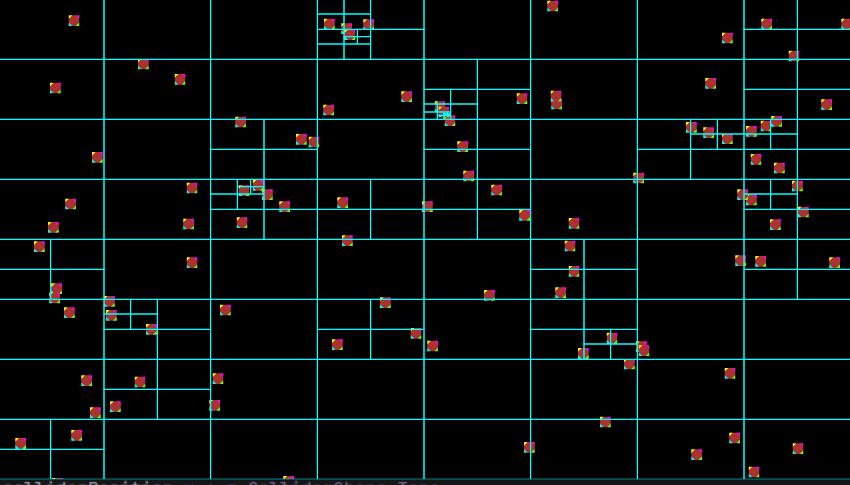

# C++_GameEngine

this readme, has mutlible purposes in is mainly for me, the devopler
I will use it a small blog, talking about what I am going to make and what I want to achieve,
and it will be used as a todo list to keep me on track with what I need to do, without needing to switch out of the IDE

This project has been created on linux Ubuntu(26.04)

## General todo's
- [ ] comment code 
- [ ] Go to Refactoring guru site. to find any patterns I can apply
- [ ] Make (0,0) middle of the screen

## Know Bugs

## game todo's
I will start using small games to furter develop the engine, to keep more motivated in keep going on deveoping the engine
because I was noticing a hard part in what I should be creating for the engine, and with small games what it should be for I hope to keep a better direction in the developement of this projet.

###  surviore game
- [ ] simple player movement
- [ ] weapon, attacking closest weapon (blue staff from vamipre survivors)
- [ ] aera effect weapon, (garlic/tome)
- [ ] enemy running at player
- [ ] level up system
- [ ] level up, choses
- [ ] dmg numbers

## my todo's Engine
- [ ] Canvas System
    - [ ] Text rendering on canvas
        - problem = fix problem where text looks squiwist
    - [ ] Image rendering on canvas
    - [ ] Buttons 
    - [ ] Eventmangar for button selection with keyboard.
- [x] input system [Command Pattern](https://gameprogrammingpatterns.com/command.html)
- [x] Camera
    - [x] First simple version Camera owned by renderer
    - [ ] Second Camera component for GameObjects (camera made for scrolling games that will follow the player where he goes)
- [ ] Object culling for rendering
    - Look into Frustum culling
- [ ] Controler input
- [ ] Event
- [ ] Audio system
- [ ] Child/Parent system
- [ ] sprite animation
- [ ] scene managar
- [ ] Collision system
    - [x] rect collidor
    - [ ] capsule collidor (if length == 0; it becomes a sphere)
    - [x] Get QuadTrees to work.
      - 
    - [x] Able to Get colliders from a portion of the Qaudtree
    - [ ] narrow phase for collision.
    - [ ] Layer system
- [ ] physic system
    - [ ] gravity reaction
- [ ] Fps counter

## refactoring code
Because I am solo on this project I will try my best to look at ways to refactor it alone.
But my knowledge is not endless so I will also be using Github Copilot, for help in the refactoring.

## Pushing conventions

you first start of with the type of push:
- feat(): = new feature or working on feature
- fix(): = as the name applies a fix for a problem
- chore(): = updating readme, adding comments, renaming parts
- refac(): = refactoring code

inside the bracket you put what it was for for example: feat(canvas), fix(canvas), ect

and after you state what you did to that part
example: feat(canvas): Added Text component.